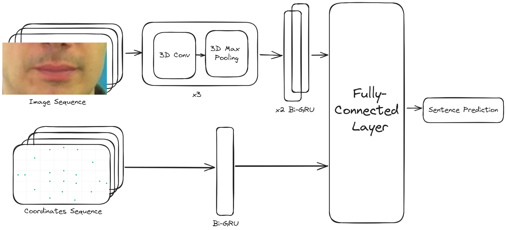
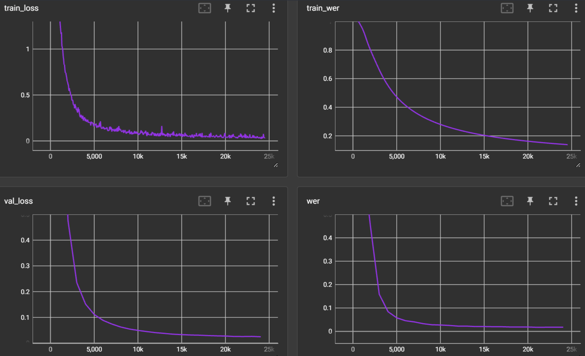

# LipCoordNet: Enhanced Lip Reading with Landmark Coordinates

## Introduction

LipCoordNet is an advanced neural network model designed for accurate lip reading by incorporating lip landmark coordinates as a supplementary input to the traditional image sequence input. This enhancement to the original LipNet architecture aims to improve the precision of sentence predictions by providing additional geometric context to the model.

## Features

- **Dual Input System**: LipCoordNet integrates raw image sequences with corresponding lip landmark coordinates, offering a more holistic view of speech articulation.
- **Enhanced Spatial Resolution**: By tracking lip movements with pinpoint accuracy, the model achieves a finer spatial analysis, crucial for understanding nuanced speech.
- **State-of-the-Art Performance**: Outperforms the original LipNet, as well as VIPL's [PyTorch implementation of LipNet](https://github.com/VIPL-Audio-Visual-Speech-Understanding/LipNet-PyTorch).
  | Scenario | Image Size (W x H) | CER | WER |
  | :-------------------------------: | :----------------: | :--: | :---: |
  | Unseen speakers (Original) | 100 x 50 | 6.7% | 13.6% |
  | Overlapped speakers (Original) | 100 x 50 | 2.0% | 5.6% |
  | Unseen speakers (VIPL LipNet) | 128 x 64 | 6.7% | 13.3% |
  | Overlapped speakers (VIPL LipNet) | 128 x 64 | 1.9% | 4.6% |
  | Overlapped speakers (LipCoordNet) | 128 x 64 | 0.6% | 1.7% |

  Note: CER (Character Error Rate) and WER (Word Error Rate) are standard metrics used to evaluate the accuracy of lip reading models.

## Getting Started

### Prerequisites

- Python 3.10 or later
- Pytorch 2.0 or later
- OpenCV
- NumPy
- dlib (for landmark detection)
- See `requirements.txt` for a detailed list of dependencies.

### Installation

1. Clone the repository:

   ```bash
   git clone https://huggingface.co/SilentSpeak/LipCoordNet
   ```

2. Navigate to the project directory:
   ```bash
   cd LipCoordNet
   ```
3. Install the required dependencies:
   ```bash
   pip install -r requirements.txt
   ```

### Usage

To train the LipCoordNet model with your dataset, first update the options.py file with the appropriate paths to your dataset and pretrained weights (comment out the weights if you want to start from scratch). Then, run the following command:

```bash
python train.py
```

To perform sentence prediction using the pre-trained model:

```bash
python inference.py --input_video <path_to_video>
```

note: ffmpeg is required to convert video to image sequence and run the inference script.

## Model Architecture



The architecture incorporates landmark coordinate processing layers to enhance the existing LipNet structure.

## Training

This model is built on top of the [LipNet-Pytorch](https://github.com/VIPL-Audio-Visual-Speech-Understanding/LipNet-PyTorch) project on GitHub. The training process if similar to the original LipNet model, with the addition of landmark coordinates as a supplementary input. We used the pretrained weights from the original LipNet model as a starting point for training our model, froze the weights for the original LipNet layers, and trained the new layers for the landmark coordinates.

The dataset used to train this model is the [EGCLLC dataset](https://huggingface.co/datasets/SilentSpeak/EGCLLC). The dataset is not included in this repository, but can be downloaded from the link above.

Total training time: 2 days
Total epochs: 51
Training hardware: NVIDIA GeForce RTX 3080 12GB



For an interactive view of the training curves, please refer to the tensorboard logs in the `runs` directory.
Use this command to view the logs:

```bash
tensorboard --logdir runs
```

## Evaluation

Achievements on the validation dataset:

- WER: 1.7%
- CER: 0.6%
- Loss: 0.0256

## License

This project is licensed under the MIT License.

## Acknowledgments

This model, LipCoordNet, has been developed with reference to the LipNet-PyTorch implementation available at [VIPL-Audio-Visual-Speech-Understanding](https://github.com/VIPL-Audio-Visual-Speech-Understanding/LipNet-PyTorch). We extend our gratitude to the contributors of this repository for providing a solid foundation and insightful examples that greatly facilitated the development of our enhanced lip reading model. Their work has been instrumental in advancing the field of audio-visual speech understanding and has provided the community with valuable resources to build upon.

Alvarez Casado, C., Bordallo Lopez, M. Real-time face alignment: evaluation methods, training strategies and implementation optimization. Springer Journal of Real-time image processing, 2021

Assael, Y., Shillingford, B., Whiteson, S., & Freitas, N. (2017). LipNet: End-to-End Sentence-level Lipreading. GPU Technology Conference.
